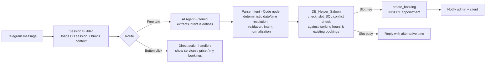

# 💅 AI Booking Agent — Beauty Salon Telegram Assistant

> An AI-powered Telegram booking assistant for beauty salons, built on **n8n**, **PostgreSQL**, and **Google Gemini**. It handles natural-language appointment requests, prevents double-booking, and automates reminders and feedback collection — with **zero manual scheduling**.


---

## 📖 Overview

Small and mid-sized beauty salons typically lose time and clients to manual, phone-based booking: missed calls, double-bookings, forgotten reminders, and no-shows. **AI Booking Agent** solves this by giving clients a conversational Telegram bot that can:

- Understand free-form messages like *"Хочу записаться на маникюр завтра в 15:00"*
- Turn that into a validated appointment in the salon's calendar
- Confirm, reschedule, or cancel bookings on request
- Automatically remind clients before their visit
- Collect a post-visit rating

The system is designed as a **multi-tenant-ready**, workflow-driven backend where the AI is responsible only for *understanding intent* — never for deciding whether a slot is actually free. That separation is what keeps the booking calendar reliable.

---

## ✨ Key Features

- 🗣️ **Natural language understanding** — clients type or say what they want in plain Russian/Ukrainian (or any language), no rigid menus required
- 📅 **Smart scheduling** — resolves relative dates (*"завтра"*, *"в пятницу"*) deterministically in code, not guessed by the LLM
- 🔒 **Double-booking protection** — every slot is validated against existing appointments, working hours, and master availability at the database level before it's confirmed
- 🔁 **Session memory** — tracks each client's in-progress booking (selected service, date, time) across messages, with automatic session timeout/reset
- 🔔 **Automated reminders** — background jobs send **24h** and **1h** pre-appointment Telegram reminders
- ⭐ **Feedback collection** — automatically asks clients to rate their visit (1–5 ⭐) after the appointment ends
- ❌ **Self-service cancel/reschedule** — clients can view, cancel, or reschedule their own upcoming appointments via inline buttons
- 🧑‍💼 **Admin notifications** — the salon owner/admin is notified in real time about new bookings, cancellations, and workflow errors
- 🤫 **Silent mode / off-topic gating** — after a booking is completed, the bot avoids spamming the client with irrelevant replies, escalating to full silence if off-topic messages continue
- 🌐 **Multi-service, multi-master support** — services are mapped to the masters who can perform them, and the system picks (or respects) an available master automatically

---

## 🏗️ Architecture & Tech Stack

| Layer | Technology |
|---|---|
| **Orchestration** | [n8n](https://n8n.io) (self-hosted workflow automation) |
| **Conversational AI / NLU** | Google Gemini (`gemini-2.5-flash`) via LangChain node |
| **Chat interface** | Telegram Bot API |
| **Database** | PostgreSQL (schema: `ai_agent_booking`) |
| **Business logic / validation** | JavaScript (n8n Code nodes) — deterministic, testable, no LLM guesswork |
| **Chat memory** | Postgres-backed conversation memory (per chat session) |

### Workflow breakdown

The project is split into four cooperating n8n workflows:

1. **`AI Booking Agent [V2 Clean]`** — the main entry point. Receives Telegram updates, builds session context, routes messages, invokes the AI agent for intent extraction, and sends replies.
2. **`DB_Helper_Saloon`** — a reusable sub-workflow exposed as an internal webhook/execute-workflow endpoint. Handles all direct database operations: fetching services/prices, checking slot availability, creating bookings, and managing draft sessions.
3. **`Salon — Фоновые Напоминания`** *(Background Reminders)* — an hourly scheduled workflow that finds appointments starting in ~24h or ~1h and sends Telegram reminders.
4. **`Salon — Feedback Collector`** — an hourly scheduled workflow that finds recently completed appointments and asks the client for a star rating.

### Database schema (high level)

```
businesses          → salon/tenant info (name, timezone)
business_settings    → working hours, buffers, reminder timing
masters              → staff members and their specialties
services             → offered services, price, duration
master_services       → many-to-many: which master can perform which service
clients              → Telegram users (tg_id, name, phone)
appointments         → confirmed/cancelled bookings, linked to client/master/service
booking_sessions     → in-progress booking state per chat (service, date/time draft)
```

---

## 🔄 Workflow & Business Logic

A core design principle of this project: **the LLM decides *what* the client wants, but code decides *whether* it's actually possible.**



**Step by step:**

1. **Ingest** — the Telegram Trigger fires on every message or button press.
2. **Session load** — `Get Active Session` pulls the client's current draft booking (service, date, time) from `booking_sessions`.
3. **Session Builder (Code node)** — normalizes the update, detects session timeout (10 min), and determines the `route` (`AI_PROCESS`, `BUTTON_CLICK`, `MAIN_MENU`, `SAVE_CONTACT`, `SAVE_FEEDBACK`, `RESCHEDULE_APPOINTMENT`, or silent-mode routes).
4. **AI Agent (Gemini)** — for free-text messages, the LLM extracts `intent`, `service_id`, `date`, and `time`, and drafts a reply — but it is explicitly instructed to copy relative dates *literally* from a pre-computed calendar table rather than calculating them itself.
5. **Parse Intent (Code node)** — this is the safety net: it independently and deterministically re-resolves relative dates/times using code (Luxon), validates format, rejects past times, and only marks a request as `is_ready_to_check_slot` once everything is structurally valid. **No slot is ever trusted purely on the LLM's word.**
6. **Slot validation (`DB_Helper_Saloon` → `check_slot`)** — a single SQL statement checks, atomically, that the requested master/service/time doesn't conflict with existing appointments, respects salon working hours, and isn't in the past.
7. **Booking creation (`create_booking`)** — only after validation passes does the system insert into `appointments`, auto-assigning an available master if one wasn't specified.
8. **Notifications** — the client gets a confirmation, and the salon admin gets a real-time Telegram alert.
9. **Reminders & feedback** — separate scheduled workflows independently pick up upcoming/completed appointments and message clients, decoupled from the booking flow itself.

---

## ⚙️ Setup & Security

### Requirements

- A running [n8n](https://n8n.io) instance (self-hosted or cloud)
- PostgreSQL database with the `ai_agent_booking` schema
- A Telegram Bot token ([@BotFather](https://t.me/BotFather))
- A Google Gemini API key

### Environment variables

All credentials and secrets are managed via n8n's built-in **Credentials** store and environment variables — **none are hard-coded in the exported workflow files**. At minimum, configure:

```env
# Telegram
TELEGRAM_BOT_TOKEN=your_telegram_bot_token

# PostgreSQL
POSTGRES_HOST=your_host
POSTGRES_PORT=5432
POSTGRES_DB=your_db
POSTGRES_USER=your_user
POSTGRES_PASSWORD=your_password

# Google Gemini
GOOGLE_GEMINI_API_KEY=your_gemini_key

# Internal webhook auth (DB_Helper_Saloon)
SALOON_WEBHOOK_SECRET=your_shared_secret
```

### 🔐 Security notes

- ⚠️ **No API keys, tokens, or credentials are included in this repository.** Exported n8n JSON files reference credentials by **ID only** — you must re-connect them to your own n8n Credentials store after import.
- The internal `DB_Helper_Saloon` webhook is protected by a shared-secret header (`x-webhook-secret`), rejecting any request that doesn't match `SALOON_WEBHOOK_SECRET`.
- Business/tenant identifiers (`business_id`) are UUIDs, not sequential IDs, to avoid casual enumeration.
- Before publishing your own fork, double-check every workflow's `credentials` blocks and any hard-coded chat IDs / tokens and replace them with your own or with environment references.

### Quick start

1. Import the four workflow JSON files into your n8n instance.
2. Create the PostgreSQL schema (`ai_agent_booking`) and tables (see [Database schema](#database-schema-high-level)).
3. Set up Telegram and PostgreSQL credentials in n8n.
4. Configure the environment variables above.
5. Activate all four workflows.
6. Message your bot on Telegram with `/start` 🎉

---

## 📄 License

Add your preferred license here (e.g. MIT).
